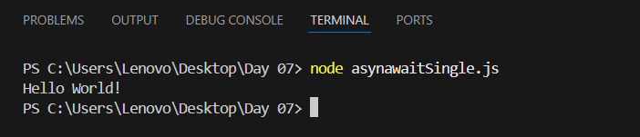
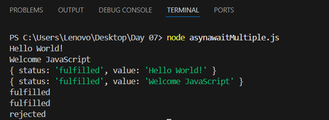
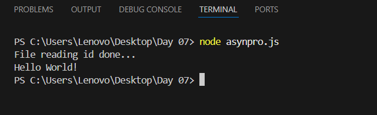
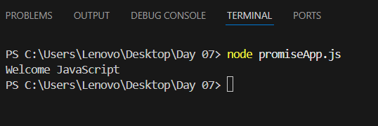

| Codes | Output |  
|-------|--------|  
|['asynawaitSingle.js'](./Codes/asynawaitSingle.js)||  
|['asynawaitMultiple.js'](./Codes/asynawaitMultiple.js)||  
|['asynpro.js'](./Codes/asynpro.js)||  
|['promiseApp.js'](./Codes/promiseApp.js)||  
