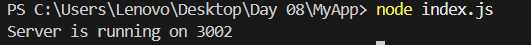
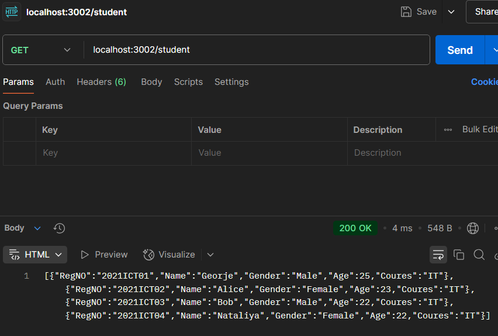
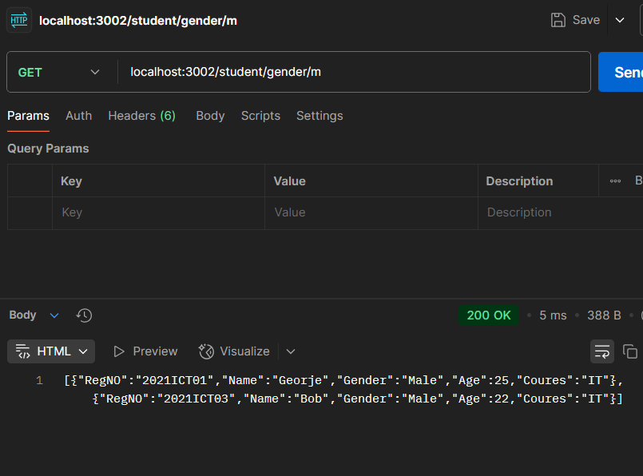

| Codes | Output |  
|-------|--------|  
|['index.js'](./Codes/index.js)||  
| ||  
| ||  
| ||  
|['StudentDB.js'](./Codes/StudentDB.js)| |  
|['StudentRoute.js'](./Codes/StudentRoute.js)| |  
|['StudentService.js'](./Codes/StudentService.js)| |  

