# MongoDB Tutorial 

## How to create database

1. Open MongoDB Compass.

2. Click “Create Database”

3. Database Name: e.g. Unidb

4. Collection Name: e.g. Students

5. Click Create Database.

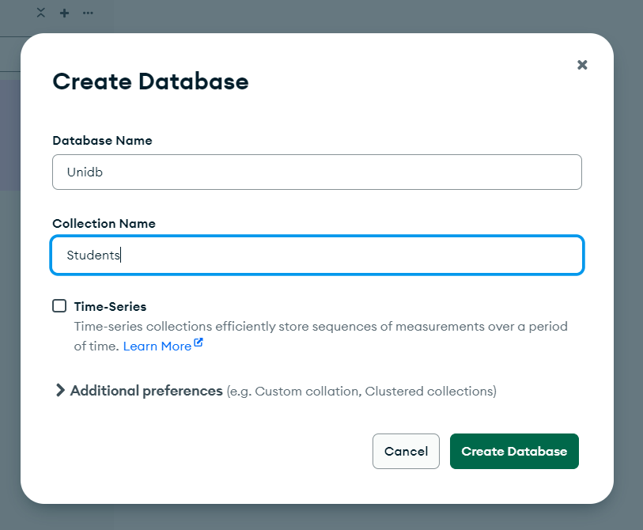
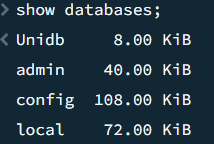

## Quaries 

1. First Open MongoDB shell
   
   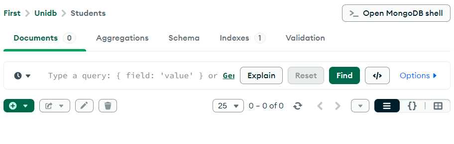

| Purpose | Query| Output |  
|-------|--------|--------| 
|✅ To Show All Databases| show databases; |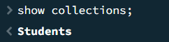|  
|✅ To Show All Collections| show collections; ||  
|✅ Switch to a Database | use Unidb; |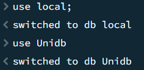|     
|✅ Add data to MongoDB without using the shell |🔹 Steps 1. Open MongoDB Compass. 2. Select your database. 3. Click on your collection 4. Click “Insert Document” 4. Enter data. 5. Click Insert |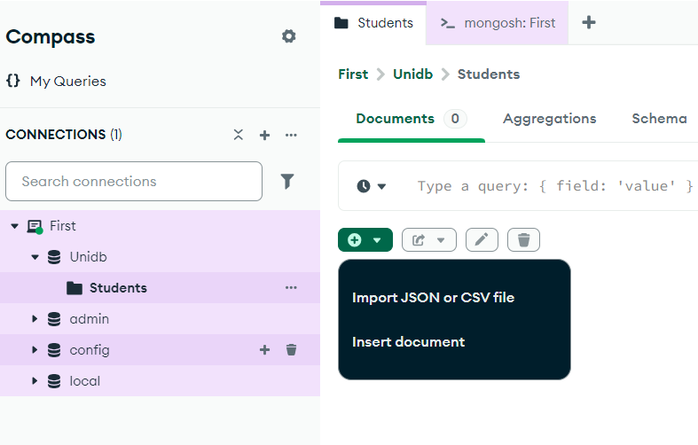|
| | || 
| | |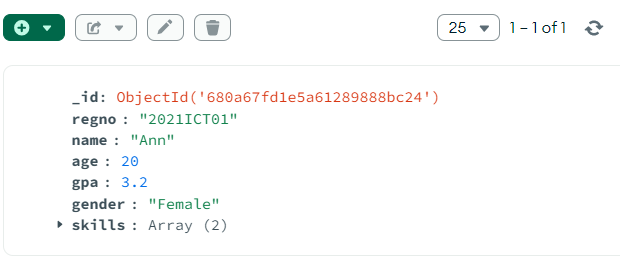| 
|✅ Add data to MongoDB with using the shell | | | 
|🔹 Add single data|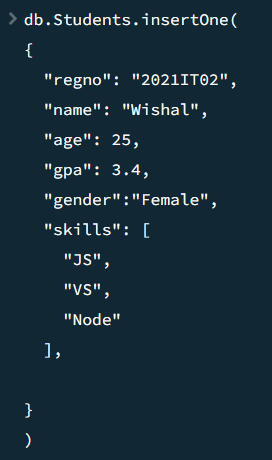|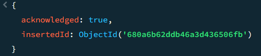| 
| | |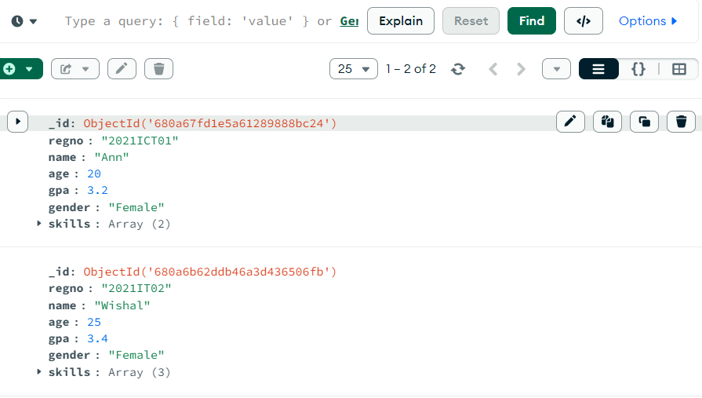| 
|🔹 Add Multiple data|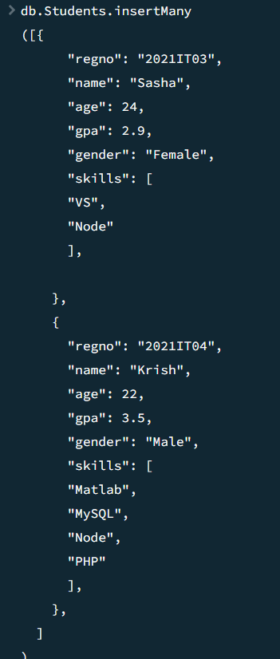|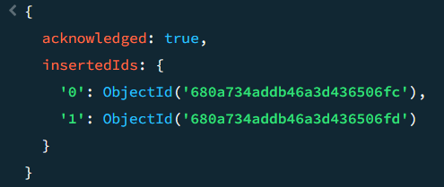| 
| | |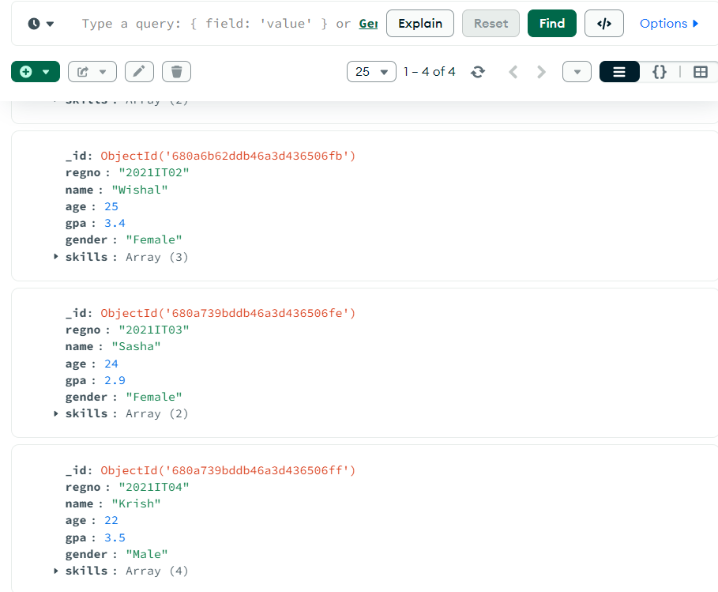| 
