# --------------- MongoDB Tutorial -------------------

## How to create a database

1. Open MongoDB Compass.

2. Click “Create Database”

3. Database Name: e.g., Unidb

4. Collection Name: e.g., Students

5. Click Create Database.

## Queries 

1. First, open the MongoDB shell
   
   

| Purpose | Query| Output |  
|-------|--------|--------| 
|✅ To Show All Databases| show databases; ||  
|✅ To Show All Collections| show collections; ||  
|✅ Switch to a Database | use Unidb; ||     
|✅ Add data to MongoDB without using the shell |🔹 Steps:  1. Open MongoDB Compass. 2. Select your database. 3. Click on your collection 4. Click “Insert Document” 4. Enter data. 5. Click Insert ||
| | || 
| | || 
|✅ Add data to MongoDB using the shell | | | 
|🔹 Add single data||| 
| | || 
|🔹 Add Multiple data||| 
| | || 
|✅Find a document using MongoDB Command Shell|db.Students.find({"gender":"Male"})|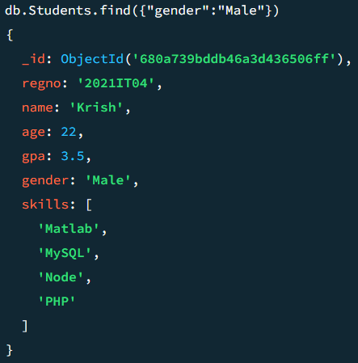 | 
|✅Using findOne to find a specific document 🔹🔹🔹🔹🔹🔹🔹🔹🔹🔹 In here display only first one|db.Students.findOne({"gender":"Female"})|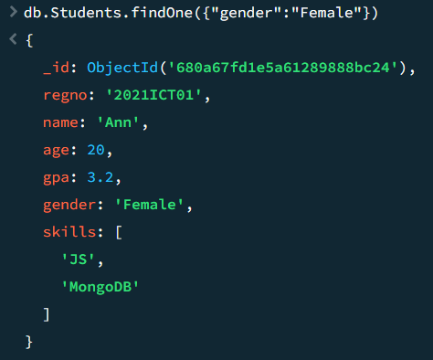|
|✅Greater than, less than, equal, not equal| | |
|🔹 Using MongoDB Shell|db.Students.find({"age":{$gt:23}})|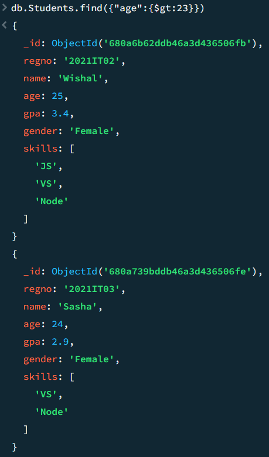|
| |db.Students.find({"age":{$lt:24}})|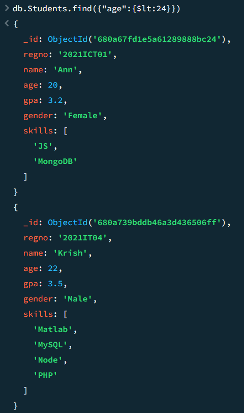|
| |db.Students.find({"name":{$eq:"Sasha"}})|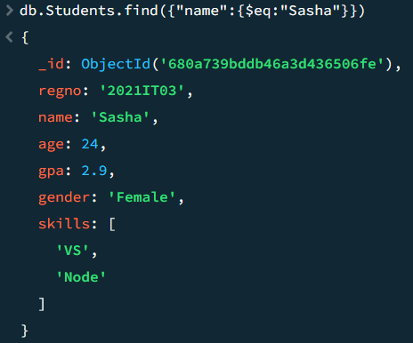|
| |db.Students.find({"gender":{$ne:"Female"}})|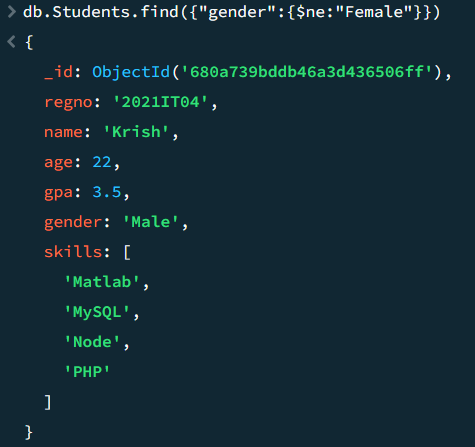|
|🔹 Using Compass|{"age":{$gt:23}}|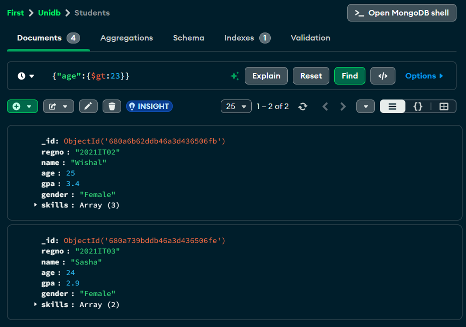|
| |{"age":{$lt:24}}|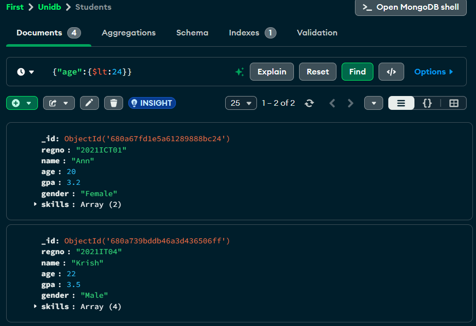|
| |{"name":{$eq:"Sasha"}}||
| |{"gender":{$ne:"Female"}}|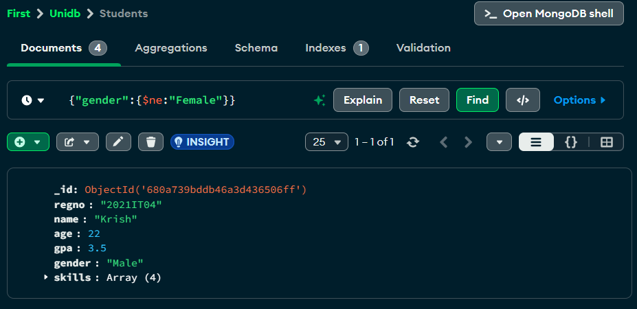|
|✅Find a document that has JS skills|db.Students.find({skills:{$in:['JS']}})|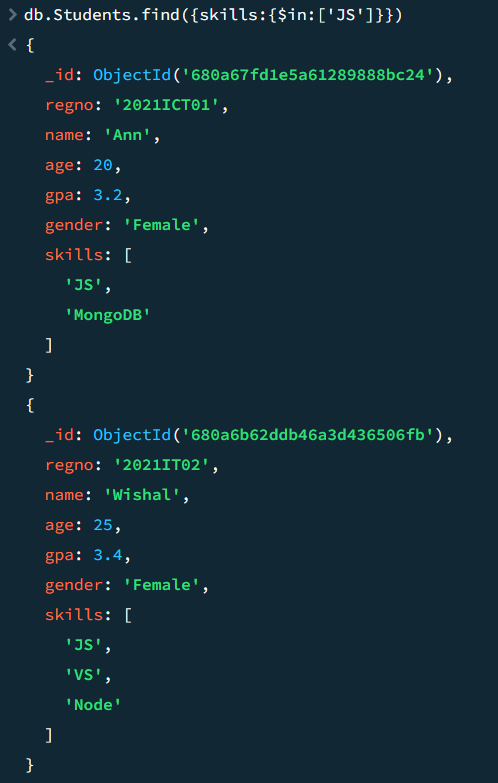|
|✅Find a document that has MongoDB or PHP|db.Students.find({"skills":{$in:['MongoDB','PHP']}})|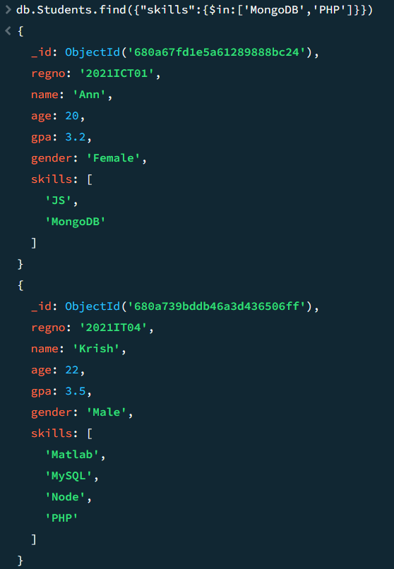|
|✅Find a document without mondoDB or VS skills|db.Students.find({"skills":{$nin:['Node','VS']}})|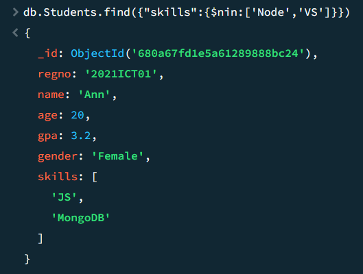|
|✅Sort data using options|{gpa:1}  -> Acending order {gpa:1}  -> Decending Order| |
|🔹Sort data using Shell|db.Students.find().sort({'gpa':1}) 🔹🔹Acending order|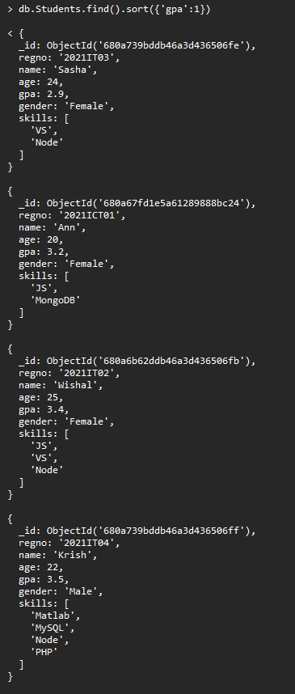|
| |db.Students.find().sort({'age':-1}) 🔹🔹Decending order|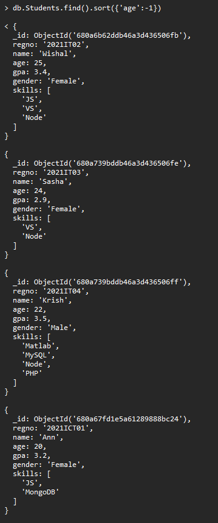|
| |db.Students.find({skills:{$in:['VS']}}).sort({'gpa':1})|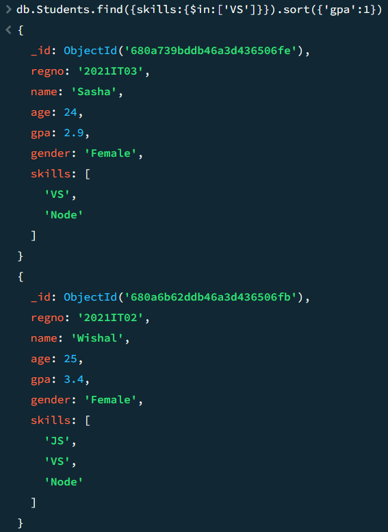|
